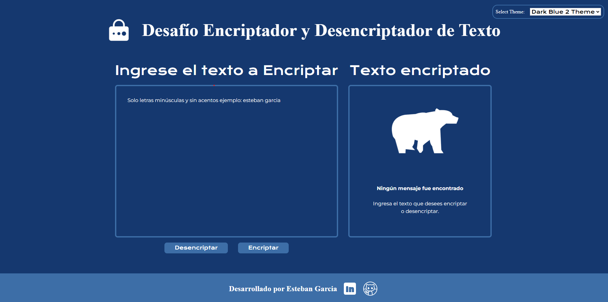

# Challenge Encriptador - Alura Latam + ONE - Oracle Next Education G7 

## Encriptador de Texto

Este proyecto es una aplicación web para encriptar y desencriptar textos. Utiliza animaciones Lottie y permite cambiar entre diferentes temas, incluido un modo oscuro.

## Sobre el desafío

El objetivo principal de este desafío es que experimentes la realización de un proyecto real, similar al trabajo diario de un desarrollador. Tendrás la oportunidad de practicar los conceptos aprendidos en los cursos hasta ahora. Este desafío te ayudará a consolidar y fortalecer tus conocimientos en lógica de programación, esenciales para el desarrollo de software.

Las "llaves" de encriptación que utilizaremos son las siguientes:
    
- La letra "e" es convertida para "enter"
- La letra "i" es convertida para "imes"
- La letra "a" es convertida para "ai"
- La letra "o" es convertida para "ober"
- La letra "u" es convertida para "ufat"

### Requisitos:
- Debe funcionar solo con letras minúsculas
- No deben ser utilizados letras con acentos ni caracteres especiales
- Debe ser posible convertir una palabra para la versión encriptada también devolver una palabra encriptada para su versión original.

    Por ejemplo:
        "gato" => "gaitober"
        gaitober" => "gato"

La página debe tener campos para
inserción del texto que será encriptado o desencriptado, y el usuario debe poder escoger entre as dos opciones.
El resultado debe ser mostrado en la pantalla.
Extras:

Un botón que copie el texto encriptado/desencriptado para la sección de transferencia, o sea que tenga la misma funcionalidad del ctrl+C o de la opción "copiar" del menú de las aplicaciones.

## Características

- Encriptación y desencriptación de textos.
- Animaciones Lottie para mejorar la experiencia del usuario.
- Selector de temas, incluyendo un modo oscuro.
- Funcionalidad responsiva para dispositivos móviles y PC.
- Botones interactivos que permiten la encriptación, desencriptación y copiado del texto.

## Tecnologías Utilizadas

- HTML5
- CSS3
- JavaScript
- Lottie Web

## Uso

1. Ingresa el texto que deseas encriptar en el campo de texto.
2. Haz clic en el botón `Encriptar` para convertir el texto.
3. Utiliza el botón `Desencriptar` para revertir el texto a su forma original.
4. Puedes copiar el texto encriptado o desencriptado usando el botón `Copiar`.
5. Cambia entre los temas claro y oscuro utilizando el selector de temas.

## Personalización

Puedes personalizar la animación Lottie y otros aspectos de la aplicación editando los archivos correspondientes:

- **Animación Lottie**: Modifica el archivo `iconos.js` y ajusta su configuración en `animation.js`.
- **Temas**: Ajusta los estilos en `theme.js` para personalizar los temas.

## Problemas Conocidos

- En algunos dispositivos móviles, la funcionalidad de desplazamiento hasta el botón de copiar puede no funcionar correctamente.
- Algunas animaciones pueden no cargar correctamente si hay problemas de conexión o compatibilidad con el navegador.

## Contribución

¡Las contribuciones son bienvenidas! Si deseas contribuir a este proyecto, por favor sigue estos pasos:

1. Haz un fork del repositorio.
2. Crea una nueva rama (`git checkout -b feature/nueva-caracteristica`).
3. Realiza tus cambios y haz commit (`git commit -am 'Añadir nueva característica'`).
4. Empuja tus cambios (`git push origin feature/nueva-caracteristica`).
5. Abre un Pull Request.

## Licencia

Este proyecto está bajo la Licencia MIT. Consulta el archivo [LICENSE](LICENSE) para más detalles.

## Contacto

Para cualquier pregunta o sugerencia, puedes contactarme a través de mis redes[LinkedIn](https://www.linkedin.com/in/estebanjgarcia/).
o escribiendo a mi correo estebanxshion@gmail.com
"""

## Licencia

[MIT](https://choosealicense.com/licenses/mit/)
